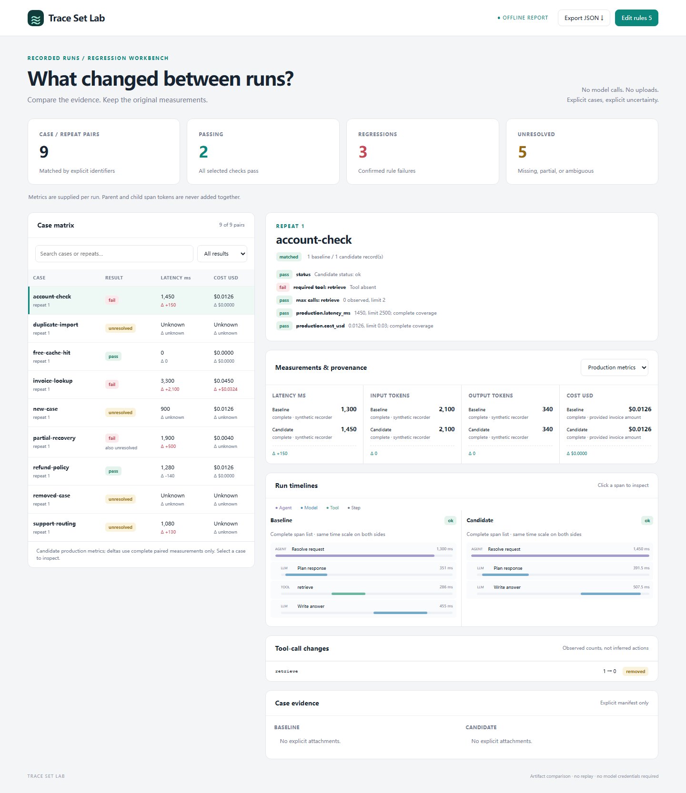

# Trace Set Lab

**Compare batches of recorded agent runs, preserve their original measurements,
and turn a regression into reviewable evidence.**

Trace Set Lab is a Node.js / TypeScript library and CLI that produces a fully
offline, single-file interactive HTML report. Compare explicit case/repetition
pairs, inspect nested timelines and tool calls, and edit reusable regression
rules in the browser. No model API keys, replay, server, account, or telemetry.

[Open the synthetic interactive demo](https://7364588.github.io/trace-set-lab/)
· [OTLP import guide](docs/otlp-import.md)
· [Contributing](CONTRIBUTING.md)



## Quick start

Requires Node.js 22 or 24. From a checkout of this repository:

```sh
npm ci
npm run build
npm run demo
```

Open `docs/demo.html` directly in a browser. The same HTML works without an
internet connection. The demo contains deliberately passing, failing, missing,
ambiguous, and partially measured cases; all data is synthetic.

To compare your recorded files, use the built CLI:

```sh
node dist/cli.js compare \
  --baseline examples/baseline.jsonl \
  --candidate examples/candidate.jsonl \
  --rules examples/rules.json \
  --json comparison.json --html comparison.html --junit comparison.xml \
  --evidence
```

Use one line in shells that do not support `\` continuation. Output filenames
must not already exist; the CLI never overwrites them. A report can be written
even when checks fail, so inspect both the artifacts and the exit code. The
example intentionally returns **2** because some evidence is unresolved.

There is no public npm installation assumed by these instructions. To produce
an installable local tarball, run `npm pack`, then install that tarball in your
own project. The tarball includes the compiled library and console entry point.

## What the report does

- **Case matrix:** search case IDs/repeats; filter passing, failed, or unresolved
  cases; see supplied candidate production latency/cost and complete-data deltas.
- **Evidence inspection:** production/evaluation metrics stay separate, each
  with its source and coverage. Select a case for side-by-side nested timelines,
  span details, observed tool-call changes, and explicit text attachments.
- **Reusable checks:** edit the rules as JSON, recompute locally, and download
  the active configuration or updated JSON results for CI.

The timelines use the same relative time scale. They preserve each run's span
tree; they do **not** guess a span-to-span match across independently generated
IDs. Tool changes are matched by exact tool name. An incomplete span list cannot
prove that a missing tool was never called.

## Recorded JSONL format

Each nonblank line is one run with explicit `case_id` and `repeat_id` strings.
Those two identifiers alone define a pair. Input order is irrelevant. Duplicate
identifiers on either side produce an ambiguous pair, and missing sides remain
unresolved. Repeated trials must have distinct repeat IDs; no run is silently
selected or averaged.

```json
{"schema_version":1,"case_id":"refund-policy","repeat_id":"1","status":"ok","spans_complete":true,"production":{"latency_ms":{"value":1200,"source":"recorded request timer","coverage":"complete"},"cost_usd":{"value":0,"source":"provided billing record","coverage":"complete"}},"evaluation":{},"spans":[{"id":"root","name":"Answer request","kind":"agent","start_ms":0,"end_ms":1200,"status":"ok"},{"id":"lookup","parent_id":"root","name":"retrieve","kind":"tool","start_ms":100,"end_ms":400,"status":"ok"}]}
```

| Field | Contract |
| --- | --- |
| `schema_version` | Exactly `1`. |
| `case_id`, `repeat_id` | Required nonempty strings; exact, case-sensitive matching. |
| `status` | `ok`, `error`, or `incomplete`; supplied by the recorder. |
| `spans_complete` | Required boolean describing the span list's coverage. |
| `production`, `evaluation` | Optional metric maps; omitted means unknown. |
| `spans` | Required array, possibly empty. |
| `evidence` | Optional explicit attachment manifest, described below. |

A span requires unique `id`, `name`, `kind` (`agent`, `tool`, `llm`, `step`),
nonnegative `start_ms`, `end_ms` (number or `null` for an open interval), and
`status`. Optional `parent_id` must reference a span in the same run. Duplicate
span IDs, reversed intervals, cycles, and missing parents are rejected. Optional
span `metrics` use the same metric representation, but are **display only**.
Times are relative milliseconds from the run's origin.

The parser retains documented fields only. It does not automatically retain
prompts, responses, arbitrary attributes, or arbitrary extra fields.

## Measurements: no invented zeros or double counting

Supported metric names are `latency_ms`, `input_tokens`, `output_tokens`, and
`cost_usd`. Every supplied metric has:

```json
{"value":12.5,"source":"recorded production timer","coverage":"complete"}
```

- `value` is a finite nonnegative number or `null`. Zero is a known measurement;
  omitted/`null` values remain unknown. Complete coverage requires a number.
- `source` records provenance as a nonempty string. It is supplied by the data
  producer and is not independently verified by this tool.
- `coverage` is `complete`, `partial`, or `unknown`.
- Production and evaluation measurements never mix. Evaluating an existing
  trace does not replace its original production latency with a near-zero
  evaluation duration.
- Run-level totals are supplied explicitly. **Parent and child span tokens are
  never summed into a total**, even when one looks like an aggregate. Missing
  run totals stay unknown. Trace extent is used only for the visual time axis.
- Cost is provided data in USD. There is no price table, model-rate guess,
  currency conversion, or derivation from token counts.
- Deltas are absolute differences and require two complete measurements.
  No percent change is calculated, so a zero baseline cannot create infinity.

## Import an existing OTLP export

The bounded importer accepts supported OTLP JSON trace exports, with optional
OpenInference/GenAI metadata. It requires an explicit trace-ID mapping:

```sh
node dist/cli.js import-otlp exported-traces.json \
  --mapping mapping.json --out recorded.jsonl
```

The [import guide](docs/otlp-import.md) documents the accepted structure, mapping,
timestamp handling, and exclusions. This is not a collector or a claim of full
OTLP compatibility. Unmapped traces are not imported; no credentials are used.

## Rules and CI

Create a starter configuration:

```sh
node dist/cli.js rules --out rules.json
```

```json
{
  "schema_version": 1,
  "require_status": "ok",
  "required_tools": ["retrieve"],
  "max_tool_calls": {"retrieve": 2},
  "budgets": {
    "production": {"latency_ms": 2500, "cost_usd": 0.03},
    "evaluation": {}
  }
}
```

Budgets are absolute maxima on the **candidate**, not relative percentage
limits. `require_status: null` disables the run-status check. Empty arrays/maps
disable the corresponding rules. Pairing is always checked.

For a partial metric or partial tool list, an observed value already above the
maximum proves failure. An observed value below the maximum cannot prove a
pass and remains unresolved. Unknown metric coverage always remains unresolved.
A required tool observed in a partial trace passes that presence check; its
absence remains unresolved. `incomplete` run status is unresolved.

| Exit | Meaning |
| --- | --- |
| `0` | Every selected check passes, with exactly one run on each side of every pair. |
| `1` | At least one confirmed failure; no unresolved checks. |
| `2` | Invalid input, file/output error, or at least one unresolved check. |

A case with both a failure and unknown evidence stays visibly failed, with its
unknown checks listed too. `summary.failed` and `summary.unresolved` can overlap;
`summary.unknown_checks` counts unresolved checks. Exit 2 takes priority so
incomplete evidence cannot yield a misleading CI success. JUnit represents such
a case as a failure with the unresolved notes; unresolved-only cases are errors.

By default, only `require_status: "ok"` is enabled. Unknown metrics that no rule
references are displayed as unknown but do not themselves fail a check.
Browser rule edits affect the open report session. Download the rules and rerun
the CLI to produce matching CI/JUnit artifacts.

## Explicit case evidence

```json
{"directory":"evidence/refund-policy-1","files":[{"path":"notes.md","label":"Policy context"}]}
```

Place this object in a run's `evidence` field. The directory is relative to that
JSONL file's directory. Each listed file is relative to the case directory.
Attachment contents are read **only** with `--evidence` (or the corresponding
library option); the manifest alone does not authorize a directory scan.

Only explicitly listed UTF-8 `.txt`, `.md`, `.json`, `.jsonl`, `.log`, and `.csv`
files are accepted. Paths use `/`; absolute paths, drives, UNC paths, `.`/`..`
segments, backslashes, percent escapes, and symlinks/junctions below the input
root are rejected. Different case/repetition owners in the same trace set cannot
share or nest evidence directories. No imported code is evaluated or executed.

Limits: input JSON/JSONL 25 MiB; rules/mappings 1 MiB; 10,000 runs per JSONL;
10,000 spans per run; 20 attachments per run; 64 KiB per attachment; 1 MiB per
run; 25 MiB total attachments per trace set. Attachments are read sequentially.
Avoid changing inputs during a read: filesystem checks are not a sandbox or an
atomic snapshot. Do not use attacker-controlled concurrently mutated folders.

## Library

```ts
import { compare, loadTraceSet, parseRules, renderHtml } from "trace-set-lab";

const baseline = await loadTraceSet("baseline.jsonl");
const candidate = await loadTraceSet("candidate.jsonl");
const report = compare(baseline, candidate);
const html = renderHtml(report);
console.log(report.exit_code);
```

For in-memory input, use `parseRun` / `parseJsonl` and `parseRules` before
comparison. `compare`, `pairRuns`, `checkPair`, `metricDelta`, `toolCounts`,
`importOtlp`, `renderHtml`, and `renderJunit` are exported with TypeScript types.
Parsing, comparison, and rendering do not read evidence. Filesystem operations
are confined to the explicit loader APIs and CLI.

## Privacy, limits, and scope

Generated HTML bundles its scripts, styles, and data. It makes no network
requests, uses a restrictive content security policy, and renders imported
strings as text. It does not load remote fonts, images, scripts, or analytics.
The report contains the run fields and any explicitly included attachments;
**review it before sharing**. It is not an automatic secret redactor.

The tool trusts recorded measurements and coverage declarations. It cannot
prove that an unrecorded action did not happen, that a tool was authorized, or
that source data is correct. It does not execute agents, call model providers,
replay side effects, score semantic answer quality, or store a production fleet.
Large cohorts produce large HTML files; the UI is designed for inspectable
batches rather than an unlimited trace database.

## Development

```sh
npm ci
npm test
npm run demo
npm pack
```

Tests cover pairing, metric coverage, tool rules, parent/child totals, OTLP
conversion, malicious HTML/XML strings, manifest traversal/junctions, CLI exit
codes, and output preservation. See [LICENSE](LICENSE) for the MIT license.
